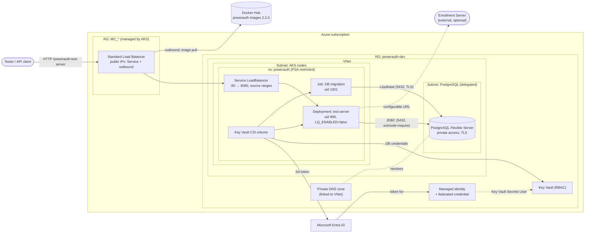

# PowerAuth Test Server on Azure

Infrastructure for running [powerauth-test-server](https://github.com/wultra/powerauth-tests/tree/develop/powerauth-test-server) on Azure Kubernetes Service with PostgreSQL, provisioned by Terraform and deployed by Argo CD (GitOps).

## Architecture

### Provisioning and GitOps


1. **Bootstrap (once):** `scripts/bootstrap-state.sh` creates the Storage Account that holds the Terraform state and grants the caller data-plane access to it.
2. **Provision:** `terraform apply` creates the network, AKS, PostgreSQL, Key Vault (with the generated DB password) and the workload identity, then installs Argo CD and a root Application pointing at `gitops/apps/<environment>/`. Terraform stops here. Until step 3 is done the application shows a render error in Argo CD (required values are missing) instead of starting a sync that cannot succeed.
3. **Hand-off:** `scripts/gitops-values.sh` writes the Terraform outputs (identity client ID, tenant ID, Key Vault name, PostgreSQL host) into the Argo CD Application values; the change is committed and pushed.
4. **Reconcile:** Argo CD pulls the repository and renders the Helm chart.
5. **Deploy in waves:** identity and secret wiring first, then the migration Job (a failed migration stops the sync), then the application.

A new application version is a commit changing `image.tag` in `gitops/apps/dev/powerauth-test-server.yaml`; every sync runs the migration Job before the rollout.

### Runtime



- **Secrets:** each pod mounts the Key Vault CSI volume and authenticates through workload identity; no secret is stored in Git or Terraform variables.
- **Database:** reachable only from the VNet; the schema is owned by the migration Job, the application only validates it.
- **Access:** testers reach the application through the Load Balancer, restricted to allowed source ranges.

## Repository layout

```
infra/terraform/          Azure infrastructure + Argo CD bootstrap (single root module)
gitops/apps/<env>/        Argo CD Applications of one environment, watched by its root Application
gitops/charts/            Helm chart of the test server (migration Job, Deployment, Service, secrets)
scripts/                  bootstrap-state.sh (Terraform state), gitops-values.sh (Terraform → GitOps hand-off)
local/                    kind-based local test (Podman by default), not used in Azure
```

## Deploy to Azure

Prerequisites: Azure CLI, Terraform >= 1.11, kubectl, jq and [mikefarah yq](https://github.com/mikefarah/yq) v4. The Azure identity needs Owner, or Contributor + Role Based Access Control Administrator, on the subscription (Terraform creates role assignments). Argo CD tracks `main`, so merge the repository content there first. Check that the PostgreSQL SKU is offered in the region: `az postgres flexible-server list-skus -l westeurope`.

```shell
az login
export ARM_SUBSCRIPTION_ID="$(az account show --query id -o tsv)"

# 1. Terraform state storage (once)
./scripts/bootstrap-state.sh

# 2. Infrastructure + Argo CD; set admin_ip_ranges in dev.tfvars to your public IP (/32) first
terraform -chdir=infra/terraform init -backend-config=backend.hcl -backend-config="key=powerauth-dev.tfstate"
terraform -chdir=infra/terraform apply -var-file=dev.tfvars

# 3. Hand-off to GitOps: who may reach the application, then commit and push
ALLOWED_SOURCE_RANGES="$(curl -s https://ifconfig.me)/32" ./scripts/gitops-values.sh
git commit -am "Configure dev environment" && git push

# 4. Verify
$(terraform -chdir=infra/terraform output -raw aks_get_credentials)
kubectl -n argocd get applications
kubectl -n powerauth get pods
curl "http://$(kubectl -n powerauth get svc powerauth-test-server -o jsonpath='{.status.loadBalancer.ingress[0].ip}')/powerauth-test-server/actuator/health"
```

Argo CD UI: `kubectl -n argocd port-forward svc/argocd-server 8443:443`, user `admin`, password from `kubectl -n argocd get secret argocd-initial-admin-secret -o jsonpath='{.data.password}' | base64 -d`.

**Day-2 operations**

- New application version: change `image.tag` and `migration.image.tag` in `gitops/apps/dev/powerauth-test-server.yaml`, commit, push. The migration Job runs before the rollout; a failed migration stops the sync.
- Rotate the DB password: increment `db_password_version` and apply. The CSI driver refreshes the synced Secret within its rotation interval (2 minutes); then restart the Deployment, because environment variables are read only at start.
- Tear down: `terraform -chdir=infra/terraform destroy -var-file=dev.tfvars`. Stop the cluster between sessions with `az aks stop`; run `az aks start` before the next `plan` or `destroy` (the Helm resources need the API server).
- If the first apply failed halfway (e.g. Key Vault RBAC not propagated yet), just re-run it. If the Key Vault secret was written but the PostgreSQL server creation failed, the re-run generates a new password for the server; increment `db_password_version` and apply again so both match.
- New environment (e.g. `test`): add `test.tfvars` (`environment` must be unique per subscription), run `init -reconfigure` with `key=powerauth-test.tfstate`, apply, then `gitops-values.sh` creates `gitops/apps/test/` from the dev Application. No code change is needed.

## Local test

Runs the same chart on a kind cluster with an in-cluster PostgreSQL instead of Azure services (secrets come from a plain Kubernetes Secret).

```shell
./local/up.sh           # helm install
./local/up.sh argocd    # Argo CD syncs local/argocd-app.yaml from the pushed branch
kubectl -n powerauth port-forward svc/powerauth-test-server 8080:80
```

The script uses Podman (`KIND_EXPERIMENTAL_PROVIDER=podman`); set `KIND_EXPERIMENTAL_PROVIDER=docker` for Docker. Remove with `kind delete cluster --name powerauth`.

## Design decisions

| Decision | Why | Alternative considered |
|---|---|---|
| AKS + Argo CD | Pull-based GitOps works without any pipeline (pipelines are out of scope); a Helm chart is the natural unit for Argo CD | **Azure Container Apps**: simpler and matches today's operations, but no chart and no in-cluster reconciliation, so GitOps would depend on a pipeline. **Flux** (GA as an AKS extension) is equally valid; the Argo CD AKS extension is still preview, so Argo CD is installed with Helm |
| Separate migration Job (init image) | The vendor ships a dedicated init image; schema changes are gated before the rollout, the app runs with `LQ_ENABLED=false` and Hibernate `validate` | Let the app run Liquibase on start (races with multiple replicas, no gate) |
| Argo `Sync` hook in wave 1, not `PreSync` | `PreSync` runs before the ServiceAccount and SecretProviderClass exist | Sync waves without a hook (Job would not re-run on upgrades) |
| Key Vault + CSI driver + workload identity | No secret in Git, Terraform state or pod specs; managed AKS add-on, nothing extra to operate | External Secrets Operator (one more component), Terraform-managed Kubernetes Secret (secret in state) |
| Ephemeral password + write-only attributes | The generated DB password never lands in the Terraform state | `random_password` resource (stored in state) |
| Private PostgreSQL (VNet integration) | No public endpoint for the database | Public access with firewall rules |
| Service `LoadBalancer` with source ranges, no ingress controller | One service, no TLS requirement for a test environment; the AKS app routing NGINX add-on is supported only until November 2026 | Gateway API (application routing with Istio, Application Gateway for Containers) once there are more services or TLS is needed |
| API server and Key Vault restricted to `admin_ip_ranges`; Key Vault reachable from the AKS subnet via service endpoint | Least exposure without private endpoints / private cluster | Private cluster + private endpoints (needs a jump host or VPN) |
| Helm, not Kustomize | The chart needs conditional logic (Key Vault vs. local secret), hooks and required-value guards | Kustomize overlays fit plain manifests with per-environment patches; mixing both on one chart adds a second config layer |
| One repository, one Terraform root module | One environment, one reviewer; Argo CD watches only `gitops/` | Separate infra and GitOps repositories and per-environment stacks as the platform grows |
| Terraform installs Argo CD via the Helm provider in the same stack | Keeps bootstrap to one `apply` | A separate bootstrap stack avoids configuring a provider from a resource of the same apply (relevant when the cluster is replaced) |

**Known trade-offs**

- AKS local accounts are enabled, so the Terraform state contains a cluster-admin client certificate that cannot be revoked (only rotated with the cluster certificates). Production should disable local accounts and use Microsoft Entra ID with Azure RBAC.
- The application connects with the PostgreSQL administrator account. Creating a dedicated role needs Terraform network access to the private server; production should use a dedicated role or Microsoft Entra authentication.
- The Terraform → GitOps hand-off (`gitops-values.sh`) is a manual, reviewed commit. A pipeline or the GitOps Bridge pattern would automate it.
- `automatic_upgrade_channel = "patch"` and node image upgrades are enabled; a single node means brief downtime during upgrades.
- Images are pulled from Docker Hub. Production should mirror them (Artifactory or Azure Container Registry cache) to avoid rate limits and pin by digest.

## Production next steps

- CI with GitHub Actions: `terraform plan` on pull requests, apply on merge (OIDC federation, no stored credentials), chart lint and policy checks.
- Separate environments (tfvars / stacks per environment, an `ApplicationSet` or one Application per environment), Argo CD `AppProject` restrictions and SSO.
- Monitoring and logs (Azure Monitor managed Prometheus + Grafana or the existing stack), alerts on sync and health status.
- High availability: at least two nodes across zones, PodDisruptionBudget, zone-redundant PostgreSQL, backups with retention per policy.
- NetworkPolicies (Cilium is already the data plane), TLS on the ingress path, Microsoft Entra ID for cluster access with local accounts disabled.
