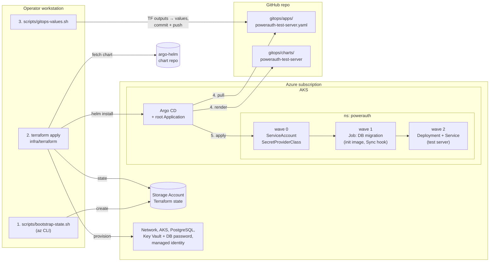

# PowerAuth Test Server on Azure

Infrastructure for running [powerauth-test-server](https://github.com/wultra/powerauth-tests/tree/develop/powerauth-test-server) on Azure Kubernetes Service with PostgreSQL, provisioned by Terraform and deployed by Argo CD (GitOps).

## Architecture

### Provisioning and GitOps

1. **Bootstrap (once):** `scripts/bootstrap-state.sh` creates the Storage Account that holds the Terraform state and grants the caller data-plane access to it.
2. **Provision:** `terraform apply` creates the network, AKS, PostgreSQL, Key Vault (with the generated DB password) and the workload identity, then installs Argo CD and a root Application pointing at `gitops/apps/`. Terraform stops here. Until step 3 is done the application shows a render error in Argo CD (required values are missing) instead of starting a sync that cannot succeed.
3. **Hand-off:** `scripts/gitops-values.sh` writes the Terraform outputs (identity client ID, tenant ID, Key Vault name, PostgreSQL host) into the Argo CD Application values; the change is committed and pushed.
4. **Reconcile:** Argo CD pulls the repository and renders the Helm chart.
5. **Deploy in waves:** identity and secret wiring first, then the migration Job (a failed migration stops the sync), then the application.

A new application version is a commit changing `image.tag` in `gitops/apps/powerauth-test-server.yaml`; every sync runs the migration Job before the rollout.

### Runtime

- **Secrets:** each pod mounts the Key Vault CSI volume and authenticates through workload identity; no secret is stored in Git or Terraform variables.
- **Database:** reachable only from the VNet; the schema is owned by the migration Job, the application only validates it.
- **Access:** testers reach the application through the Load Balancer, restricted to allowed source ranges.
